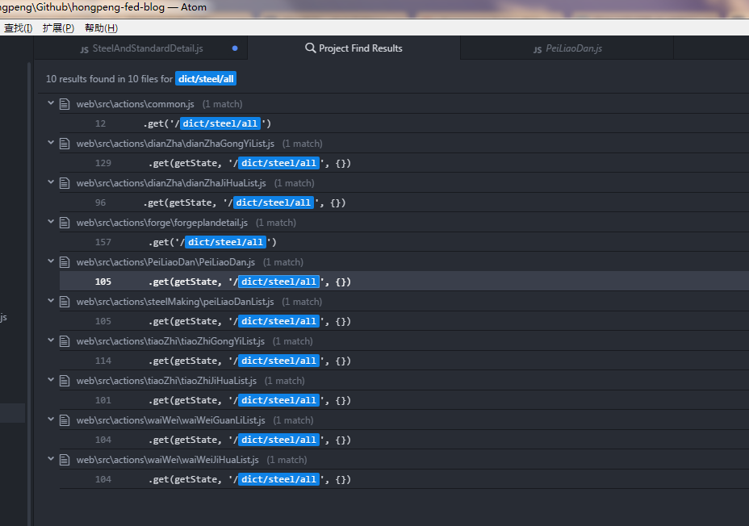
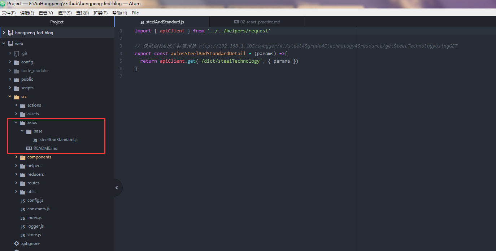

React 实践关键话题（一）
===
> 2017.12.03 发布，最后更新于 2018.01.12

## 使用面向属性的 CSS

```
.mt10 {
  margin-top: 10px;
}
.pt10 {
  padding-top" 10px;
}
.fs16 {
  font-size: 16px;
}
.fw200 {
  font-weight: 200;
}
.fc666 {
  font-color: #666;
}

<div className="mt10 fs16"></div>
```

* [精简高效的CSS命名准则/方法](http://www.zhangxinxu.com/wordpress/2010/09/%E7%B2%BE%E7%AE%80%E9%AB%98%E6%95%88%E7%9A%84css%E5%91%BD%E5%90%8D%E5%87%86%E5%88%99%E6%96%B9%E6%B3%95/)

## CSS 命名遵守 BEM 规范

class 命名冲突是编码 CSS 的一大问题，通过 BEM 前后缀规范来合理管理 css class 声明

block + element + modifier（修饰）

    header-navMenu--checked

不必担忧生产模式下的 class 名字过长，可以配置 css-loader 进行 hash 处理成固定位数。BEM 规范是面向未来 CSS 标准的，同时也被 CSS 模块化支持的，建议根据项目模块实际对编码 CSS 的要求酌情使用

* [Get BEM](http://getbem.com/introduction/)
* [CSS Modules 用法教程，快速入门](http://www.ruanyifeng.com/blog/2016/06/css_modules.html)
* [Webpack css-loader 配置](https://doc.webpack-china.org/loaders/css-loader/#-)

## 合理地进行组件拆分

#### 为什么需要拆分组件？

* 一个组件编码成百上千行，可读性差
* 对于一些公有方法、配置甚至公有组件，抽象出来可以避免编码冗余
* 将很多业务逻辑堆砌在一个组件场景中，会加大认知负载（尽量将业务逻辑与渲染逻辑分离）
* 方便做单元测试，也方便做调试

#### 如何拆分组件？

###### 切割 render()

```
  class Panel extends Component {
    render() {
      return (
        <div>
          {this.renderHeader()}
          {this.renderBody()}
          {this.renderFooter()}
        </div>
      )
    }
  }
```

###### 组合使用智能组件与木偶组件

* 木偶组件：组件行为根据外界传递的 `props` 的变化而改变，它往往作为一个复杂业务场景体系中的一部分，就像一个“木偶”一样被操纵着，它可以拥有独立于组件之外的自己的交互状态管理，但这些交互对于整个交互场景来说往往是局部的。
* 智能组件：智能组件操纵着木偶组件，往往通过接口请求、用户关键交互行为整合出提供给木偶组件使用的数据并对其调用

###### 使用无状态组件

使用无状态函数构建的组件称为无状态组件（0.14 版本后新增的，官方颇为推崇），E.g:

```
  function Button({ color = 'blue', text = 'Confirm' }) {
    return (
      <button className={`btn btn-${color}`}>
        <em>{text}</em>
      </button>  
    )
  }
```
无状态组件只传入 `props` 和 `context` 两个参数；也就是说，它不存在 `state`，也没有生命周期方法。在合适的情况下我们都应该且必须使用无状态组件，它不会在调用时创建新实例，而是始终保持一个实例，避免了不必要的检查和内存分配，做到了内部优化

###### 目录结构

```
|———— components // 组件
  |———— common // 共有组件
  |———— contract // 业务大模块
    |———— productContractList // 具体页面目录
      |———— index.jsx
      |———— SubPage1.jsx
      |———— SubPage2.jsx
```

## 处理受控组件 onChange

React 表单控件会绑定一个 `onChange` 事件，每当表单状态发生变化，都会被写入到组件的 `state` 中，这种组件被称为“受控组件”，组件渲染出的状态与它的 value 或 checked prop 相对应。React 通过这种方式消除了组件的局部状态，使得应用的整体状态更加可控

受控组件更新 state 流程：

1. 可以通过在初始 state 中设置表单默认值
2. 表单值发生变化时调用 onChange 事件处理器
3. 事件处理器通过合成事件对象 e 拿到改变后的状态，并更新应用的 state
4. setState 触发重新渲染，完成表单组件值的更新

使用受控组件最令人头疼的是，我们需要为每个组件绑定一个 onChange 事件，并且定义一个事件处理器来同步表单值和组件状态，这是一个必要条件，在某些简单的情况下，推荐使用一个事件处理器来处理多个表单域

```
handleChange = (type, e) => {
  const { value } = e.target

  this.setState({
    [type]: value
  })
}

render() {
  const { name, age } = this.state

  return (
    <div>
      <input value={name} onChange={this.handleChange.bind(this, 'name')} />
      <input value={age} onChange={this.handleChange.bind(this, 'age')} />
    </div>  
  )
}
```

## 抽象出来的公有代码该放在哪里？

* 静态配置：使用可视化库的默认配置（Echarts、HighCharts）；使用 UI 控件库针对项目业务需求的默认配置（AntD）；
* Helper 函数：复用业务逻辑进行数据处理；格式化数据结构 formatter；对请求成功与失败的统一 promise 流程处理等
* Common Component：往往需要进行视图渲染，具有独立的生命周期和交互状态控制，大多需要 props 配置项。是一个独立的可重用功能块

## 声明事件处理函数

推荐2种绑定事件处理函数的方式：

1. constructor 中手动 bind: `this.handleChange = this.handleChange.bind(this)`
2. 使用 [ES7 class 的实例属性](http://es6.ruanyifeng.com/#docs/class#Class-的静态属性和实例属性)

方法1的缺点是 constructor 中 bind 模版代码比较多
方法2的缺点是目前还是实验阶段属性，但 [create-react-app](https://github.com/facebookincubator/create-react-app) webpack 配置是支持了的

至于 `onClick={(e) => { this.handClick(e) }}` 缺点：

* 组件每次渲染时会创建新的处理函数
* 处理函数作为 props 传递子组件时会导致额外的重复渲染（任意2个函数不相等，pureComponent 的 shouldComponentUpdate 优化失效）
* 不利于调试，这个是匿名函数，在错误堆栈中难以定位

推荐使用 ES7 类的实例属性方式

```
class LoggingButton extends React.Component {
  handleClick = () => {
    console.log('this is:', this);
  }

  render() {
    return (
      <button onClick={this.handleClick}>
        Click me
      </button>
    )
  }
}
```

[Handling Events - reactjs.org](https://reactjs.org/docs/handling-events.html)

## 使用 prop-types 对公有组件进行类型检测

对于全局频繁使用的公有组件，引入 `prop-types` 对其进行 prop 类型检测，一方面可以在调试阶段收到错误警告，另一方面方便他人熟悉你的组件参数配置，效果等同写参数注释

[prop-types](https://github.com/facebook/prop-types)

## React 生命周期钩子中该写什么

###### WillMount

组件还未渲染。一般用在服务器端渲染，在 componentWillMount 前加载好数据项

###### DidMount

组件渲染完毕了，可以拿到 ref 了。可以做一些非 React 组件的初始化操作、进行 fetch 数据等

###### WillReceiveProps

可以根据 nextProps 更新 state，这里不会引起额外的重新渲染（props 和 state 的改变融合为一起进行渲染）

###### WillUpdate

因为还没有渲染，所以这里获取的 DOM 是旧 DOM；慎重地执行 setState，要有一个截至点，不然会一直死循环

###### DidUpdate

因为已经渲染了，所以这里获取的 DOM 是新的 DOM

###### render

这里只做渲染，将一些计算的逻辑提到函数外面去

###### WillUnMount

销毁计时器、全局事件监听

## 选择 React's state 还是 Redux Store？

#### 判断数据需要入 Redux Store 的一些原则

* 应用中其他模块是否需要使用这份数据？（Do other parts of the application care about this data？）
* 存原始数据而不是派生数据（Do you need to be able to create further derived data based on this original data？）
* 这份数据是否用于驱动多个组件？（Is the same data being used to drive multiple components?）
* 需要根据指定时间点恢复数据（Is there value to you in being able to restore this state to a given point in time (ie, time travel debugging)）
* 本地缓存数据，避免冗余请求（Do you want to cache the data (ie, use what's in state if it's already there instead of re-requesting it)?）

对于短期使用的、非全局性的并且不会通过复杂场景去改变的数据，使用 React's State，比如 UI 层面的一个 toggle 开关，表单 input 状态；
对于全局使用的、或者通过多种场景可以改变的数据，使用 Redux's Store，比如缓存的用户信息，帖子草稿
黄金原则是尽量减少应用臃肿

> Use React for ephemeral state that doesn't matter to the app globally and doesn't mutate in complex ways. For example, a toggle in some UI element, a form input state. Use Redux for state that matters globally or is mutated in complex ways. For example, cached users, or a post draft.

> The rule of thumb is: do whatever is less awkward.

#### 将 State 按持续时间分类

* 短期：在应用中迅速变化的数据。往往是一些改变数据状态的原子操作，比如在文本域中键入字符串可以看作是在表单提交前的未完成操作，建议存储在 local React state 中
* 中期：在应用中持续一段时间的数据。用户浏览APP过程中需要保持的数据，比如来自请求的数据，或一些数据想要持续保存到页面刷新。
* 长期：用户多次访问过程中需要持续存在的数据。这些数据会在刷新页面后或另行访问页面后持续存在的数据，由于 Redux Store 会在浏览器刷新后被重新创建，因此这些数据考虑存放在 浏览器 local Storage 中或是数据库中

#### 考虑数据应用场景的广度与深度

考虑 APP 中有多少 Component 需要这份数据，当这份数据越多地被 App 中不同组件所需要，将它存储在 Redux Store 中的益处就更大。当这份数据是单独在某个特定组件中使用的或者仅仅是整体 APP 中的一小部分时，存储在 React'state 或许是更好的选择

React 应用的状态存储在最顶层组件中，它的子组件去消费这些状态。有时这意味着在用于存储状态的组件和用于展示数据的组件之间存在很多层，顶层状态通过传递 props 的方式沿着 Virtual DOM 向下逐层传递。一两个层级还好，但当层级过多时，每当子组件需要获取一个新的 state，就要去编辑很多其他组件来实现这个传递流程，对于这种情况，将 state 存储在 Redux Store 中并通过容器组件从 Store 中获取数据要方便很多

#### 跟踪 State 的变更

另一个选择使用 Redux Store 的原因是需要跟踪 state 的变更。比如 replay events、撤销/重做 操作，或者仅仅是想打印 state 如何变化

* [Redux FAQ: Organizing State](https://redux.js.org/docs/faq/OrganizingState.html)
* [Question: How to choose between Redux's store and React's state?](https://github.com/reactjs/redux/issues/1287)
* [React State vs. Redux State: When and Why?](https://spin.atomicobject.com/2017/06/07/react-state-vs-redux-state/)
* [You Might Not Need Redux](https://medium.com/@dan_abramov/you-might-not-need-redux-be46360cf367)

## dispatch 异步 action

Redux 本身从 dispatch action，到 reducer，再到更新 Store 中的 State 整个过程是同步进行的。可以通过使用 Thunk 函数进行中间件拦截，用回调触发普通 action，从而实现异步处理，这点上所有 Ruedux 异步方案都是类似的

Eg.使用 [redux-thunk](https://github.com/gaearon/redux-thunk)

```
// action types
const GET_DATA = 'GET_DATA',
      GET_DATA_SUCCESS = 'GET_DATA_SUCCESS',
      GET_DATA_FAILED = 'GET_DATA_FAILED'

// action creator
const getDataAction = (id) => {
  return (dispatch, getState) {
    // 乐观更新
    dispatch({
      type: GET_DATA,
      payload: id
    })

    api.getData(id)
      .then((res) => {
        dispatch({
          type: GET_DATA_SUCCESS,
          payload: res
        })
      })
      .catch((err) => {
        dispatch({
          type: GET_DATA_FAILED,
          payload: err
        })  
      })
  }
}

//reducer
const reducer = (oldState, action) => {
    switch(action.type) {
      case GET_DATA:
          return oldState;
      case GET_DATA_SUCCESS:
          return successState;
      case GET_DATA_FAILED:
          return errorState;
    }
}
```

乐观更新与保守更新：

多数异步场景都是保守更新的，即等到请求成功才渲染数据。而与之相对的乐观更新，则是不等待请求成功，在发送请求的同时立即渲染数据。

乐观更新最常见的例子就是微信等聊天工具，发送消息时消息立即进入了对话窗，如果发送失败的话，在消息旁边再作补充提示即可。这种交互”乐观”地相信请求会成功，因此称作乐观更新(Optimistic update)。

对比 [redux-promise](https://github.com/acdlite/redux-promise) 、[redux-promise-middleware](https://github.com/pburtchaell/redux-promise-middleware)、[redux-action-tools](https://github.com/kpaxqin/redux-action-tools)、[redux-saga](https://github.com/redux-saga/redux-saga)

使用 redux-thunk 的劣势是需要写很多模板代码，因此在准备 dispatch 异步 action 之前先考虑是否有必要，或者一个普通 action 就可以解决问题呢？

## bindActionCreators

[react-redux](https://github.com/reactjs/react-redux) 是 Redux 官方提供的 React 绑定库

    connect([mapStateToProps], [mapDispatchToProps], [mergeProps], [options])

连接 React 组件与 Redux Store，连接操作不会改变原有组件类，而是会返回一个新的与 Redux Store 连接的组件类

* `mapStateToProps(state, [ownProps])` 定义该参数后组件将会监听 Redux Store 的变化，任何时候只要 Store 发生改变，mapStateToProps 函数就会被调用。该回调函数必须返回一个纯对象，这个对象会与组件的 props 合并。
* `mapDispatchToProps(dispatch, [ownProps])` 如果传递的是一个函数，该函数将接收一个 dispatch 函数，并将返回的对象通过 dispatch 函数与 action creator 绑定在一起（需要用到 Redux 辅助函数 `bindActionCreators()`）。如果省略该参数，默认会将 `dispatch()` 注入到组件 props 中

Eg.

```
import * as actions from '../../actions'
...

function mapStateToProps (state) {
  let { contract } = state
  return {
    contract
  }
}

function mapDispatchToProps (dispatch) {
  return bindActionCreators(actions, dispatch)
}

export default withRouter(connect(mapStateToProps, mapDispatchToProps)(ProductContractList))
```

[bindActionCreators() API](https://redux.js.org/docs/api/bindActionCreators.html)

> The only use case for bindActionCreators is when you want to pass some action creators down to a component that isn't aware of Redux, and you don't want to pass dispatch or the Redux store to it.

一般情况下可以直接通过 `store` 实例调用 `dispatch`。惟一使用 `bindActionCreators` 的场景是当你需要把 action creator 往下传到一个组件上，却不想让这个组件觉察到 Redux 的存在，而且不希望把 Redux store 或 dispatch 传给它。

使用 bindActionCreators 的优劣分析：

优势：编码时省去了写 dispatch(xxxActionCreator())，而直接像调用函数一样去 dispatch actions
劣势：

* 正因为它和一般函数一样，因此很容易与其他普通函数编码混淆，多写一个 dispatch 可以提醒编码这这个操作将要更新 Store
* 会将 action creator 绑定到 props 上（当使用了 * as 后尤其显著），违背了 React Props 的理念（往往 props 仅需要关注父组件传递的和 connect store 监听的数据，这些都是可以预测并且可能会改变的，而 action creator 注入 props 一方面污染了 props 命名空间，另一方面编码时通过 this.props.actionCreator 的方式去取会显得难以查找来源，其实直接在头部将 action creator import 进来就好）

建议：绝大多数情况下避免使用 bindActionCreators()，相应地，在文件头部引入 action creators，而这并不妨碍 使用 * as 引入整个模块；对于仅使用少数几个 Action Creator 的组件，不推荐使用 * as，便于编码时显式地追溯 action creator 来自哪个模块，而不是通过搜索去寻找对应模块

## 其他的一些编码 Redux 建议

#### 索引 action type

由于编码 action 和 reducer 时都会用到 action type，建议在 constants 中设置 action type 索引，避免硬编码。并且应注意将 type 变量名和字符串名统一大写，eg. `export const GET_PRODUCT_LIST = 'GET_PRODUCT_LIST`。当 constants 文件过大时候可以通过模块进一步拆分，这并不妨碍我们将其索引

#### 抽出公有的 action、reducer

将 APP 公有的数据仅存在 Store 中的一处，而不是根据不同业务模块编码多个 action 和 reducer，并将这些公有数据存在各自业务模块下



注意在 fetch 公有数据前先检查 Store 中是否已经存在了，避免重复请求

#### 索引不必 dispatch action 的 axios 请求

发送请求与数据入 Store 是两回事，并不是请求到的数据都要入 Store；发送异步请求与 dispatch 异步 action 也是两回事，并不是使用异步请求，就要用异步 action。

对于应用层使用到不需要 dispatch 异步 action 的请求，推荐单独索引在一个模块中，而不是硬编码在应用层。偶尔随着业务的复杂，这个请求也会被其他模块所使用，命名一般加 axios 或 fetch 前缀



应用层调用：

```
import { axiosSteelAndStandardDetail } from '../../axios/base/steelAndStandard'

...
componentDidMount() {
  axiosSteelAndStandardDetail({ associateId: xxx }).then((res) => {
    this.setState({
      associateData: res,
      selectSteelId: String(res.steelId),
      selectStandardId: String(res.standardId)
    })
  })
}
```

#### 其他一些小点

* 明确 action creator 和 reducer 职责，他们仅仅是关注 Store 的，不要将一些业务逻辑处理、请求前的参数结构格式化等操作放到其中进行
* Reducer 中通过 switch 语句去区分 action type，而不是 if else，可读性和可控性更好
* Reducer 中可以通过 return initialState 来重置 store 模块

## 调试工具推荐

* 使用 [react-devtools](https://github.com/facebook/react-devtools) 浏览器定位 React 组件，查看组件结构、state、props
* 使用 [redux-devtools](https://github.com/gaearon/redux-devtools) 图形化界面跟踪 store 变化

## 推荐的编码习惯

#### 写头文件注释

* @File：描述这个文件是做什么的，隶属于哪个业务模块
* @TODO：有待进一步完善的，比如部分代码需要重构、未开发功能备忘等
* 公有组件的配置参数说明，推荐使用 `prop-types` 进行类型检测的同时标注参数含义
* 若多人交叉维护项目，不建议注释维护者姓名

#### 设置 git 对大小写敏感

Git 默认配置对大小写不敏感，偶尔会因为修改目录大小写导致引入模块 Moudule not found 错误，建议 `git config --global core.ignorecase false`

#### 避免硬编码

对于全项目通用的内容，注意避免硬编码，更好地方式是统一索引在一处。常见的索引数据例如 接口返回的错误码定义、业务场景下的常量、UI 层常量（常用的几种颜色、固定尺寸）、redux action tyoe

## 其他相关资源

[Airbnb React/JSX 编码规范](https://github.com/JasonBoy/javascript/tree/master/react)
