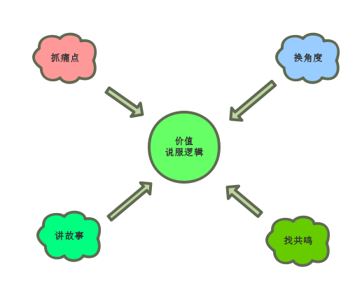

沟通，如何具有说服力？
===

> 2017.12.30 发布，最后更新于 2018.03.13
>
> 本文内容参考 [Wonder王达 国际贸易资深从业者](https://www.zhihu.com/people/wdar20000/activities)

## 说服逻辑及技巧

#### 价值说服逻辑

晓之以情，动之以理，“价值说服逻辑” 主要讨论如何说“理”。说理的核心是说价值，谈判话题围绕着对方价值与我方价值展开。

围绕价值说服逻辑的4个技巧：

* 抓痛点：充分考虑对方的价值，尤其对方的痛点
* 讲故事：有时候一个具体的案例要比数据更有说服力。心理学中，往往一个具象化事件更能唤起人们对这个事件潜在发生概率的担忧。讲故事的目的是让对方充分认识到这件事的价值
* 换角度：说服对方，其实是说服对方认同你观点的价值，不妨将你的话题角度放在对方认知、认可的价值体系中展开。通过对方的价值观让他认识到他所可以认知到的价值
* 找共鸣：除了肯定双方各自的价值立场，也可以共同去寻找一种价值立场

#### 情感说服逻辑

有时事实不是问题的答案，态度才是。道理说的再充分，可对方就是不认同你，大多是情感上对方没有被说服。

沟通中产生的分歧是怎么产生的？不同的人看待同一客观事实，他们的看待角度不同、预期不同、态度不同，导致分歧

2个要点：

* 不要制造对立情绪：你永远不可能说服一个恨你的人，或者将你视为敌人的人。如果不小心陷入了对立情绪，可以表达对对方的理解：“我非常理解你的困难，...”，表达了你愿意站在对方角度思考的意愿。甚至可以将对方的观点简要复述：“我非常理解你的困难，你的困难是...”，这样让对方意识到你不是泛泛而谈对他的理解，而是确实考虑到了他的情景，这样便巧妙地减少了你与对方的对立程度。
* 甚至承认对方的价值观点

#### 全身而退

偶尔我们手中的牌确实比对方少，对方成功在谈判中击败了你，为了最大程度降低你的损失，可以在谈判结束时卸掉自己的责任与决定权：“您的所说确实十分深刻，我需要回去再和同事以及领导讨论、协商一下，征求一下他们的意见”。这样说后，一下子将自己的决定权降低，潜在地告诉对方这个决定不是你一个人能决定的，需要再次协商，让对方整场谈判的战利品化为泡影，将己方的损失降低到最低。

## 销售式沟通思维

沟通有4种常见方式：告知、咨询、销售、合作。在沟通中运用“销售”的方式，需要注意以下几点：

1. 需要了解对方的需求，而不是单纯传递信息，因为对方可以选择不接受或者只是表面上接收信息。比如，同样是希望对方支持你的项目，用告知的方式表达是这样“我的项目很好，我希望你给我的项目支持”，用销售的方式表达则是“如果你支持我，我的项目会给你带来这些价值”。（不是说告知的方式不对，而是说要根据沟通场景和内容选择最好的方式来达到沟通目标）

2. 不跟进的沟通和没发生过是一样的。很多时候，就算你当时很明确地沟通了信息并且对方也表示接收到了，但是如果你没有后续跟进，那么你沟通的内容很快会被淹没在无数的信息流里面，对方也很有可能很快忘记。销售的方式就是要合理地跟进，在沟通完之后很快能和对方保持持续互动直到达成你的目标。

3. 百折不挠。销售的方式去沟通，你给自己的预期就是这件事不会那么容易解决，需要一个持续沟通和行动的过程。中间也许会碰到挫折，甚至反对，但是你会想方设法去解决问题找到双方的共赢点，而不是随便放弃，然后去抱怨都是对方不配合工作。
